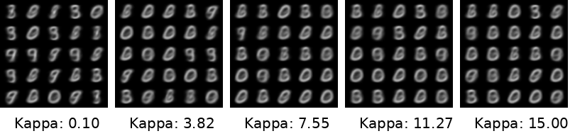

# a simple vmf + vae test repo on mnist

- original repo was repurposed from https://github.com/lyeoni/pytorch-mnist-VAE
- work from https://github.com/jiacheng-xu/vmf_vae_nlp was extensively used, i.e almost all of it was copied and pasted

## Requirements
- pytorch
- torchvision
- numpy
- matplotlib
- torchdataset

## Why ?

I love vaes, i think they're still misused, i think a better distribution on a hypersphere can allow us to learn more robust representations, i think this is a good starting point to explore that. i'll further work on this soon hopefully :3

## Samples

- kappa deiotes the concentration of the distribution, the higher the value the more concentrated the distribution is, kappa acts inversely to the temperature parameter in the softmax function, the higher the value the less the distribution is spread out, the lower the value the more the distribution is spread out. higher kappa leads to more mean effect, lower kappa leads to more variance effect.

### vmf - Kappa (trained on 2.0) from 0.1 to 15.0, 50 epochs

### vmf - Kappa (trained on 4.0) sampled inference from 0.1 to 15.0, 50 epochs

### vmf - Kappa (trained on 10.0) sampled inference from 0.1 to 15.0, 50 epochs

### vmf - Kappa (trained on 50.0) sampled inference from 0.1 to 15.0, 50 epochs

### vmf - Kappa (trained on 100.0) sampled inference from 0.1 to 15.0, 50 epochs

### Summary,
It's observable, higher kappa during training, but lower kappa during inference provideds the sharpest and most diverse samples, this is because the model learns more representative and in-domain features because of the higher kappa, but during inference, the model is able to sample more diverse samples because of the lower kappa, this is a good thing, because it means the model is able to generate more diverse samples, and is not overfitting to the training data.

### Gaussian - 50 epochs

